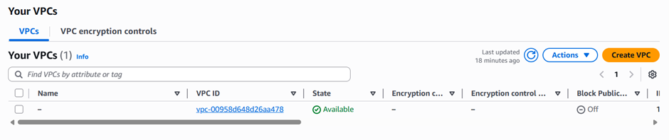

# ⚡ AWS Lambda Practical  
## Start and Stop EC2 Instances using Lambda

This document explains how to automate starting and stopping EC2 instances using AWS Lambda and IAM roles.

---

# 🚀 Part 1: Create EC2 Instance

## 📌 Step 1: Launch Instance
1. Click on **Launch Instance**  
2. Give instance a **Name tag**  


---

## 📌 Step 2: Select AMI
Choose an OS for the instance environment  


---

## 📌 Step 3: Select Instance Type
- Example: `t3.micro` (Free tier)  


---

## 📌 Step 4: Key Pair
- Select existing or create new key pair for authentication  


---

## 📌 Step 5: Security Group
- Configure firewall rules for secure access  


---

## 📌 Step 6: Storage Configuration
- Define storage size  
- Select number of instances (if needed)  


---

## ✅ Step 7: Instance Created


---

# 🔐 Part 2: Create IAM Role for Lambda

## 📌 Step 1: Create Role
Click on **Create Role**  


---

## 📌 Step 2: Select Trusted Entity
- Choose **AWS Service**  
- Select **Lambda** as use case  


---

## 📌 Step 3: Add Permissions
- Attach required permissions (e.g., EC2 access)  


---

## 📌 Step 4: Name & Description
- Give role name and description  


---

## 📌 Step 5: Review
- Verify permissions and configuration  

---

## ✅ Step 6: IAM Role Created


---

# ⚙️ Part 3: Create Lambda Function

## 📌 Step 1: Go to Lambda Dashboard
Click **Create Function**  


---

## 📌 Step 2: Create Function
- Select **Author from scratch**  


---

## 📌 Step 3: Configure Function
- Enter function name  
- Select runtime (e.g., Python)  
- Architecture → Default  


---

## 📌 Step 4: Attach IAM Role
- Select the IAM role created earlier  
- Keep other settings default (or customize if needed)  

---

## ✅ Step 5: Lambda Function Created


---

# 🧠 Part 4: Start EC2 Instance using Lambda

## 📌 Step 1: Open Code Editor
Go to **Code** section in Lambda  

---

## 📌 Step 2: Add Python Code (Start Instance)

```python id="5nbvpl"
import boto3

ec2 = boto3.client('ec2')

def lambda_handler(event, context):
    ec2.start_instances(InstanceIds=['YOUR_INSTANCE_ID'])
    return "Instance Started"
